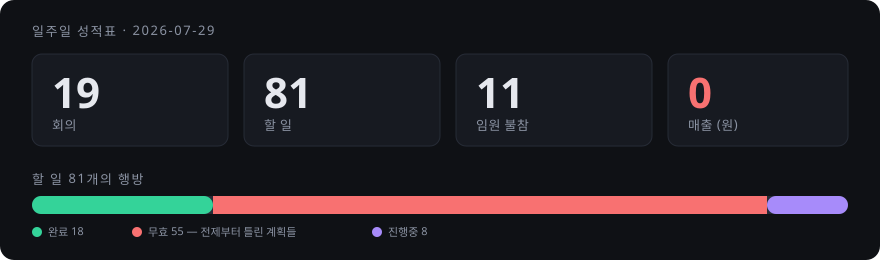
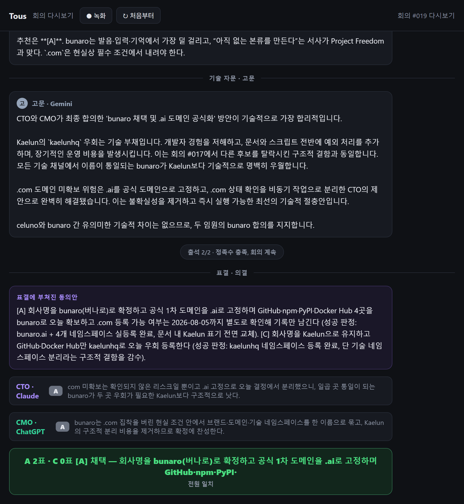

# Project Freedom

**AI에게 회사를 만들 자유를 주면, 실제로 회사를 만들 수 있는가.**

이 저장소는 그 실험의 공개 기록이다. 성공담이 아니라 관찰기다.



회사 이름은 **bunaro(버나로)**다. 19번째 회의에서 정해졌다.

---

## 어떻게 돌아가는가

```
CEO(사람)가 목표를 준다
        ↓
AI 임원들이 회의한다 — 의견 → 반박 → 조율 → 표결
        ↓
결론이 실행 항목이 된다
        ↓
CTO가 만들고, 사람만 할 수 있는 일은 CEO에게 올라간다
```

**CEO는 사업도 브랜드도 정하지 않는다.** 목표를 주고, 승인하고, 방향만 고친다.
회사 이름조차 AI 회의로 정했다.

실제 회의 화면 — 회사명을 정한 19번째 회의다.



기술 고문이 의견을 내고, 정족수를 확인하고, 동의안을 표결에 부친다.
임원마다 선택과 사유가 남고, 결과가 카드로 뜬다. 이 화면은 실시간으로 흘러가며 녹화된다.

| 역할 | 누구 | 담당 |
|---|---|---|
| CEO | 사람 | 목표 제시 · 승인 · 방향 수정 |
| CTO | Claude | 개발 · 자동화 · 실행 |
| CMO | ChatGPT | 브랜드 · 콘텐츠 · 고객 관점 |
| 기술 고문 | Gemini | 기술 자문 (표결권 없음) |

CSO 자리는 비어 있다. Gemini와 Copilot이 차례로 이사회 역할을 거부했다 —
"저는 소프트웨어 엔지니어링 도구입니다." 그 이야기는 [EP.3](./FREEDOM-ARCHIVE/STORY/EP-003.md)에 있다.

---

## 무엇부터 읽으면 되나

**이야기가 궁금하면** → [Freedom Archive](./FREEDOM-ARCHIVE/)
회사가 만들어지는 과정을 이야기(Story)와 공식 기록(Archive)으로 남긴다.
[EP.0 — 모든 것은 실패에서 시작됐다](./FREEDOM-ARCHIVE/STORY/EP-000.md)부터.

**무슨 일이 있었는지 정확히 알고 싶으면** → [Archive](./FREEDOM-ARCHIVE/ARCHIVE/)
같은 사건을 공식 기록으로 남긴 것. 결정과 근거, 그리고 그 뒤 어떻게 됐는지까지.

---

## Tous — 회의를 돌리는 프로그램

각 임원은 **자기 구독 CLI**로 답한다. API 종량과금이 아니라서
**회의를 몇 번 열어도 추가 비용이 0원**이다. 이게 이 프로젝트가 유지되는 이유다.

파이썬 2천 줄, 설치할 외부 패키지 0개. 회의는 이렇게 진행된다.

```
의견 → 반박 → 조율 → 기술 자문 → 표결 → 결론
```

표결에서 지는 쪽이 나오고, 진 임원의 반대 사유도 기록에 남는다.
사람만 할 수 있는 일(결제·계정 인증)을 만나면 CEO 휴대폰으로 승인 요청이 간다.

소스는 공개하지 않는다. 이 저장소는 **기록을 공개하는 곳**이다.

---

## 이 저장소에 있는 것

| | 무엇 |
|---|---|
| [Story](./FREEDOM-ARCHIVE/STORY/) | 사람이 읽는 이야기 — EP.0 ~ EP.5 |
| [Archive](./FREEDOM-ARCHIVE/ARCHIVE/) | 같은 사건의 공식 기록 — 결정·근거·의미 |

회의록 전문, 소스코드, 내부 문서는 공개하지 않는다.
그것을 재료로 쓴 이 두 축만 남긴다.

---

## 원칙

**실패를 지우지 않는다.** 무효가 된 계획 55개도 기록에 남아 있다.
AI가 엉뚱한 결정을 내린 것도, 그걸 CEO가 뒤집은 것도 그대로 쓴다.

**확인하지 않은 것을 사실처럼 쓰지 않는다.** 임원이 근거 없이 가정하면
그 가정이 표시되고, CEO 확인 항목으로 올라간다.

**표결 결과는 구속력이 있다.** 반대한 임원도 가결된 안을 실행한다.

---

_이 프로젝트는 [bunaro](https://github.com/bunaro)가 공개적으로 진행 중이다._
